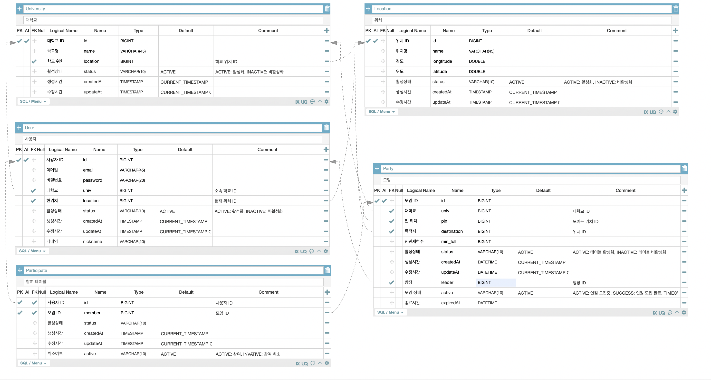

# Catch 차 ! - Backend


## 개발 팀원

- 경희대 길지운
- 부산대 신종민
- 인하대 허영은
- 숙명여대 박예준

## 개발 환경

---

- IDE : IntelliJ IDEA Ultimate
- SpringBoot 2.7.5
- Java 11
- Gradle

## 기술스택

---

- BackEnd - `Spring Boot` `JDBC` `MySQL`
- Infra - `AWS EC2`

## 소개

- Catch차!는 대학생에게 새로운 경험을 제공하는 택시 카풀 서비스입니다.
- 목표 : 대학생의 이동을 쉽고 가성비 있게 만들기 위한 서비스입니다.
- 4명이서 같이타기 4명이서 나눠내기, 간편하게 더치페이, 정해진 위치에서 만나 타기

## 구현 기능

- 방장(캐쳐)가 택시를 잡기위해 대기 시간과 최소 출발인원 설정 → 방 생성
- 사용자는 방 리스트를 통하여 참여하게 된다.

## **데이터 모델링 ERD(with AQueryTool)**


### 2. API 명세서

### `/party` : POST (그룹 생성)

- **Data Params**


    | Key | Value | Type | Nullable |
    | --- | --- | --- | --- |
    | school_id | 학교 | Long | Not Null |
    | pin_id | 핀 위치 | Long | Not Null |
    | destination | 목적지 이름 | String | Not Null |
    | main_catcher_id | 그룹생성자 id | Long | Not Null |
    | time_limit | disable 시간 | Date | Not Null |
    | min_full | 몇명부터 출발 가능한지 | Long | Not Null |
- **Success Response**

    ```java
    {
        "isSuccess": true,
        "code": 1000,
        "message": "요청에 성공하였습니다.",
        "result": {
            "partyId": 26
        }
    }
    ```


### `/party` : PATCH (그룹 참여)

- **Data Params**


    | Key | Value | Type | Nullable |
    | --- | --- | --- | --- |
    | party_id | 파티 id | Long | Not Null |
    | user_id | 유저 id | Long | Not Null |
- **Success Response**
    - 1000

        ```java
        {
            "isSuccess": true,
            "code": 1000,
            "message": "요청에 성공하였습니다.",
            "result": [
                {
                    "id": 1,
                    "member": 2,
                    "status": "ACTIVE",
                    "createdAt": "2022-11-13",
                    "updatedAt": "2022-11-13",
                    "active": "ACTIVE",
                    "email": "abc@naver.com",
                    "nickname": "Wiz"
                },
                {
                    "id": 1,
                    "member": 3,
                    "status": "ACTIVE",
                    "createdAt": "2022-11-13",
                    "updatedAt": "2022-11-13",
                    "active": "ACTIVE",
                    "email": "dfg@naver.com",
                    "nickname": "Ari"
                }
            ]
        }
        ```


### `/party/{id}` : GET (그룹 단일 조회)

- **Query Strings**


    | Key | Value | Type | Nullable |
    | --- | --- | --- | --- |
    | party_id | 파티 id | Long | Not Null |
- **Success Response**
    - 1000

        ```json
        {
            "isSuccess": true,
            "code": 1000,
            "message": "요청에 성공하였습니다.",
            "result": {
                "id": 1,
                "univ": "인하대학교",
                "pin": "후문",
                "destination": "인문관",
                "minFull": 4,
                "active": "ACTIVE",
                "timer": 3,
                "expiredAt": "2022-11-12 23:28:46",
                "memberNum": 2
            }
        }
        ```


### `/party` : GET (그룹 전체 조회)

- **No Request**
- **Success Response**
    - 1000

      ⇒ 만료 시간(expiredAt)이 급한 순으로 정렬하도록

        ```json
        {
            "isSuccess": true,
            "code": 1000,
            "message": "요청에 성공하였습니다.",
            "result": [
                {
                    "id": 1,
                    "univ": "인하대학교",
                    "pin": "후문",
                    "destination": "인문관",
                    "minFull": 4,
                    "active": "ACTIVE",
                    "timer": 3,
                    "expiredAt": "0분 32초 전",
                    "memberNum": 3
                },
                {
                    "id": 3,
                    "univ": "인하대학교",
                    "pin": "후문",
                    "destination": "인문관",
                    "minFull": 3,
                    "active": "ACTIVE",
                    "timer": 3,
                    "expiredAt": "2분 22초 전",
                    "memberNum": 3
                },
                {
                    "id": 26,
                    "univ": "인하대학교",
                    "pin": "인문관",
                    "destination": "인문관",
                    "minFull": 3,
                    "active": "ACTIVE",
                    "timer": 3,
                    "expiredAt": "3분 0초 전",
                    "memberNum": 3
                },
                {
                    "id": 2,
                    "univ": "인하대학교",
                    "pin": "후문",
                    "destination": "인문관",
                    "minFull": 3,
                    "active": "ACTIVE",
                    "timer": 3,
                    "expiredAt": "5분 0초 전",
                    "memberNum": 3
                }
            ]
        }
        ```


### `/party/{id}` : PATCH (그룹 참여 취소)

- **Data Params**
    - Body


        | Key | Value | Type | Nullable |
        | --- | --- | --- | --- |
        | party_id | 파티 id | Long | Not Null |
        | user_id | 유저 id | Long | Not Null |
        
        ```jsx
        {
        	"party_id": 1,
        	"user_id": 1
        }
        ```
        
        → Participate 테이블에 필드 추가

- **Success Response**

  수정된 파티 정보

    - 1000

        ```json
        {
            "isSuccess": true,
            "code": 1000,
            "message": "요청에 성공하였습니다.",
            "result": [
                {
                    "id": 1,
                    "member": 2,
                    "status": "ACTIVE",
                    "createdAt": "2022-11-13",
                    "updatedAt": "2022-11-13",
                    "active": "ACTIVE",
                    "email": "abc@naver.com",
                    "nickname": "Wiz"
                },
                {
                    "id": 1,
                    "member": 3,
                    "status": "ACTIVE",
                    "createdAt": "2022-11-13",
                    "updatedAt": "2022-11-13",
                    "active": "ACTIVE",
                    "email": "dfg@naver.com",
                    "nickname": "Ari"
                }
            ]
        }
        ```


### *`/party/search?pin_id=1`* : GET (pin 필터링 → 그룹 목록 조회)

- **URL Params**


    | Key | Value | Type | Nullable |
    | --- | --- | --- | --- |
    | pin_id | 모임 장소 ID | Long | Not Null |
- **Success Response**
    - 1000

      ⇒ 만료 시간(expiredAt)이 급한 순으로 정렬하도록

      ⇒ 후문만 출력

        ```json
        {
            "isSuccess": true,
            "code": 1000,
            "message": "요청에 성공하였습니다.",
            "result": [
                {
                    "id": 1,
                    "univ": "인하대학교",
                    "pin": "후문",
                    "destination": "인문관",
                    "minFull": 4,
                    "active": "ACTIVE",
                    "timer": 3,
                    "expiredAt": "0분 32초 전",
                    "memberNum": 3
                },
                {
                    "id": 3,
                    "univ": "인하대학교",
                    "pin": "후문",
                    "destination": "인문관",
                    "minFull": 3,
                    "active": "ACTIVE",
                    "timer": 3,
                    "expiredAt": "2분 22초 전",
                    "memberNum": 3
                },
                {
                    "id": 2,
                    "univ": "인하대학교",
                    "pin": "후문",
                    "destination": "인문관",
                    "minFull": 3,
                    "active": "ACTIVE",
                    "timer": 3,
                    "expiredAt": "5분 0초 전",
                    "memberNum": 3
                }
            ]
        }
        ```


### *`/party/search?univ_id=1`* : GET (univ 필터링 → 그룹 목록 조회)

- **URL Params**


    | Key | Value | Type | Nullable |
    | --- | --- | --- | --- |
    | univ_id | 대학 ID | Long | Not Null |
- **Success Response**
    - 1000

      ⇒ 만료 시간(expiredAt)이 급한 순으로 정렬하도록

      ⇒ 인하대학교만 출력

        ```json
        {
            "isSuccess": true,
            "code": 1000,
            "message": "요청에 성공하였습니다.",
            "result": [
                {
                    "id": 1,
                    "univ": "인하대학교",
                    "pin": "후문",
                    "destination": "인문관",
                    "minFull": 4,
                    "active": "ACTIVE",
                    "timer": 3,
                    "expiredAt": "0분 32초 전",
                    "memberNum": 3
                },
                {
                    "id": 3,
                    "univ": "인하대학교",
                    "pin": "후문",
                    "destination": "인문관",
                    "minFull": 3,
                    "active": "ACTIVE",
                    "timer": 3,
                    "expiredAt": "2분 22초 전",
                    "memberNum": 3
                },
                {
                    "id": 26,
                    "univ": "인하대학교",
                    "pin": "인문관",
                    "destination": "인문관",
                    "minFull": 3,
                    "active": "ACTIVE",
                    "timer": 3,
                    "expiredAt": "3분 0초 전",
                    "memberNum": 3
                },
                {
                    "id": 2,
                    "univ": "인하대학교",
                    "pin": "후문",
                    "destination": "인문관",
                    "minFull": 3,
                    "active": "ACTIVE",
                    "timer": 3,
                    "expiredAt": "5분 0초 전",
                    "memberNum": 3
                }
            ]
        }
        ```


### `/party/expire/{id}` : PATCH (그룹 만료)

- **URL Params**


    | Key | Value | Type | Nullable |
    | --- | --- | --- | --- |
    | partyId | 파티 번호 | Long | Not Null |
- **Success Response**
    - 200 (custom: 1000)

        ```json
        {
            "isSuccess": true,
            "code": 1000,
            "message": "요청에 성공하였습니다.",
            "result": {
                "partyId": 26
            }
        }
        ```